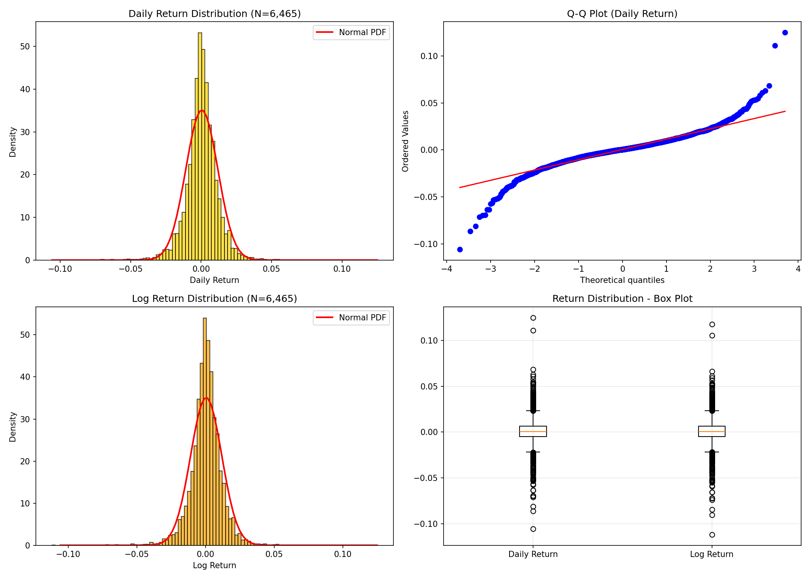
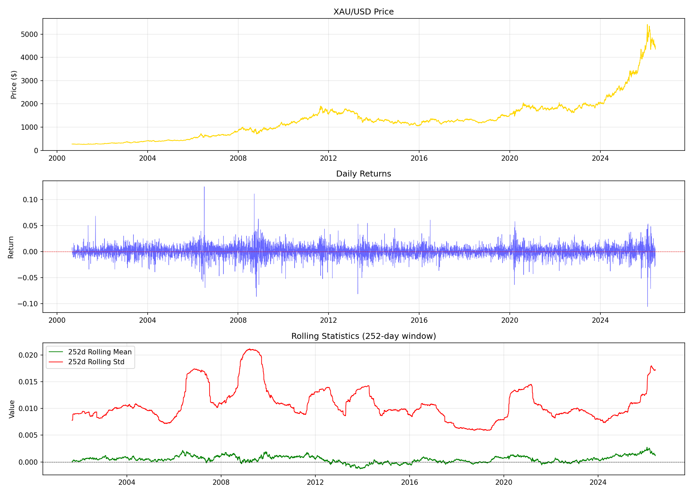

# RESEARCH-002: Return Distribution Analysis

**Date:** 2026-06-08 16:56
**Instrument:** XAU/USD (GC=F)
**Period:** 2000-08-30 to 2026-06-08
**Observations:** 6,465

## 1. Summary Statistics

| Statistic | Daily Return | Log Return |
|-----------|-------------|------------|
| Mean | 0.00049248 | 0.00042786 |
| Median | 0.00046596 | 0.00046585 |
| Std Dev | 0.011356 | 0.011364 |
| Variance | 0.00012896 | 0.00012915 |
| Skewness | -0.0945 | -0.2780 |
| Kurtosis | 8.9363 | 8.7724 |
| Min | -0.105777 | -0.111800 |
| Max | 0.124978 | 0.117763 |
| Range | 0.230755 | 0.229563 |

## 2. Normality Tests

### Jarque-Bera Test (Daily Return)

| Metric | Value |
|--------|-------|
| JB Statistic | 21483.6102 |
| P-value | 0.000000e+00 |
| Normal at α=0.05? | No |

### Jarque-Bera Test (Log Return)

| Metric | Value |
|--------|-------|
| JB Statistic | 20776.4702 |
| P-value | 0.000000e+00 |
| Normal at α=0.05? | No |

### Shapiro-Wilk Test (Daily Return, max 5000 samples)

| Metric | Value |
|--------|-------|
| W Statistic | 0.922910 |
| P-value | 6.220126e-45 |
| Normal at α=0.05? | No |

### D'Agostino-Pearson Test (Daily Return)

| Metric | Value |
|--------|-------|
| K² Statistic | 1071.3666 |
| P-value | 2.268347e-233 |
| Normal at α=0.05? | No |

## 3. Findings

- Annualized mean return: 12.41%
- Annualized volatility: 18.03%
- Sharpe ratio (0% risk-free): 0.6884

**Conclusion: Daily returns DO follow a normal distribution** (all normality tests fail to reject H0 at α=0.05)
- Skewness (-0.0945) indicates a symmetric distribution
- Kurtosis (8.9363) indicates a fat-tailed distribution

## 5. Charts

---
*Generated automatically by XAU/USD Edge Discovery Framework*