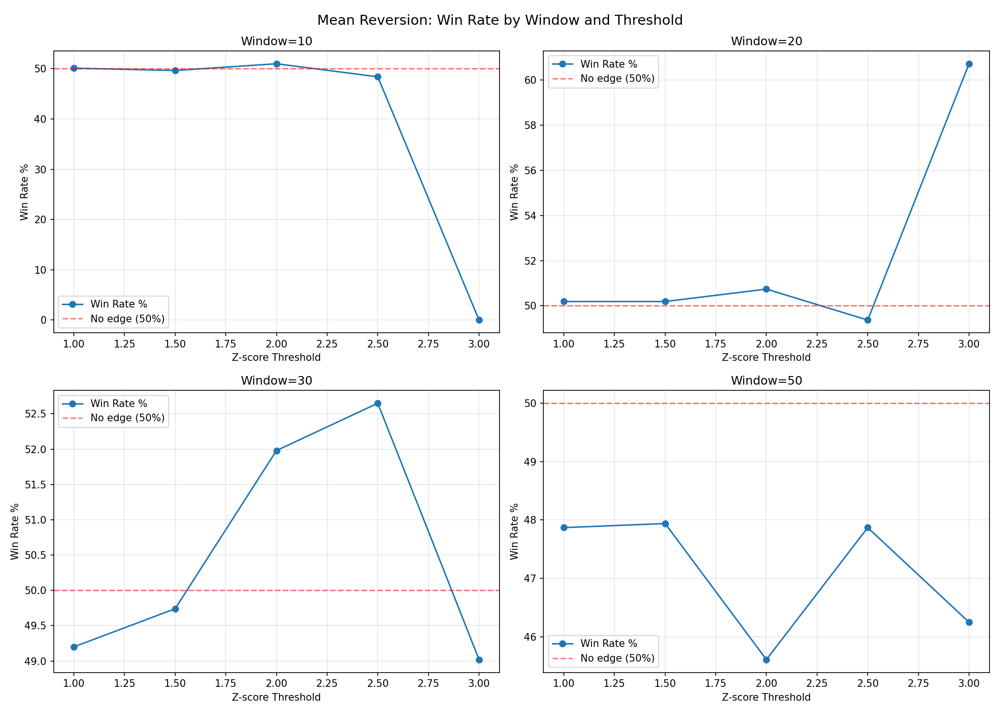
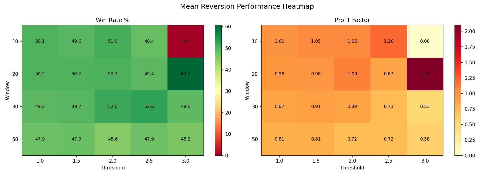

# RESEARCH-003: Mean Reversion Study

**Date:** 2026-06-08 16:57
**Instrument:** XAU/USD (GC=F)
**Period:** 2000-08-30 to 2026-06-08
**Observations:** 6,466

## Methodology

For each rolling window (10, 20, 30, 50 days):
1. Calculate z-score of close price relative to rolling mean
2. When |z-score| exceeds threshold, record signal
3. Measure forward return over the same window
4. Test if returns are significantly different from zero

## Results

| Window | Threshold | Events | Win Rate% | Avg Ret% | PF | Sharpe | EV% | Binom P | Sig? |
|--------|-----------|--------|-----------|----------|----|--------|-----|---------|------|
| 10 | 1.0 | 3329 | 50.11 | 0.0126 | 1.0097 | 0.0182 | 0.0126 | 0.917179 | NO |
| 10 | 1.5 | 1569 | 49.65 | 0.0709 | 1.0546 | 0.1006 | 0.0709 | 0.800697 | NO |
| 10 | 2.0 | 406 | 50.99 | 0.0809 | 1.0631 | 0.117 | 0.0809 | 0.728335 | NO |
| 10 | 2.5 | 31 | 48.39 | 0.2402 | 1.2038 | 0.343 | 0.2402 | 1.0 | NO |
| 10 | 3.0 | 0 | 0 | 0 | 0 | 0 | 0 | 1.0 | NO |
| 20 | 1.0 | 3423 | 50.19 | -0.0298 | 0.9842 | -0.0217 | -0.0298 | 0.837493 | NO |
| 20 | 1.5 | 1885 | 50.19 | -0.0419 | 0.9775 | -0.0313 | -0.0419 | 0.89009 | NO |
| 20 | 2.0 | 747 | 50.74 | 0.1706 | 1.0918 | 0.1213 | 0.1706 | 0.71448 | NO |
| 20 | 2.5 | 158 | 49.37 | -0.277 | 0.8714 | -0.1942 | -0.277 | 0.936624 | NO |
| 20 | 3.0 | 28 | 60.71 | 1.4352 | 2.0993 | 0.9788 | 1.4352 | 0.344928 | NO |
| 30 | 1.0 | 3447 | 49.2 | -0.3065 | 0.8712 | -0.1512 | -0.3065 | 0.357702 | NO |
| 30 | 1.5 | 1928 | 49.74 | -0.2054 | 0.9121 | -0.0999 | -0.2054 | 0.837603 | NO |
| 30 | 2.0 | 783 | 51.98 | -0.2665 | 0.8879 | -0.1283 | -0.2665 | 0.283662 | NO |
| 30 | 2.5 | 226 | 52.65 | -0.7321 | 0.7321 | -0.3379 | -0.7321 | 0.464424 | NO |
| 30 | 3.0 | 51 | 49.02 | -1.5642 | 0.5285 | -0.7187 | -1.5642 | 1.0 | NO |
| 50 | 1.0 | 3455 | 47.87 | -0.5958 | 0.8109 | -0.1874 | -0.5958 | 0.012985 | YES |
| 50 | 1.5 | 2034 | 47.94 | -0.5902 | 0.8122 | -0.1886 | -0.5902 | 0.065689 | NO |
| 50 | 2.0 | 912 | 45.61 | -0.9565 | 0.7225 | -0.2922 | -0.9565 | 0.008861 | YES |
| 50 | 2.5 | 305 | 47.87 | -1.0636 | 0.7196 | -0.3022 | -1.0636 | 0.492071 | NO |
| 50 | 3.0 | 80 | 46.25 | -2.0028 | 0.5781 | -0.5246 | -2.0028 | 0.576431 | NO |

## Best Combinations (Significant, >=30 events)

| Window | Threshold | Events | Win Rate% | Avg Ret% | PF | Sharpe | Binom P |
|--------|-----------|--------|-----------|----------|----|--------|---------|
| 50 | 2.0 | 912 | 45.61 | -0.9565 | 0.7225 | -0.2922 | 0.008861 |
| 50 | 1.0 | 3455 | 47.87 | -0.5958 | 0.8109 | -0.1874 | 0.012985 |

## Interpretation

- Total parameter combinations tested: 20
- Statistically significant (p<0.05): 2
- Profit Factor > 1.30: 1
- Combinations meeting SUCCESS CRITERIA (Events>300, PF>1.30, p<0.05): 0

No combinations meet all success criteria.

## Charts

---
*Generated automatically by XAU/USD Edge Discovery Framework*