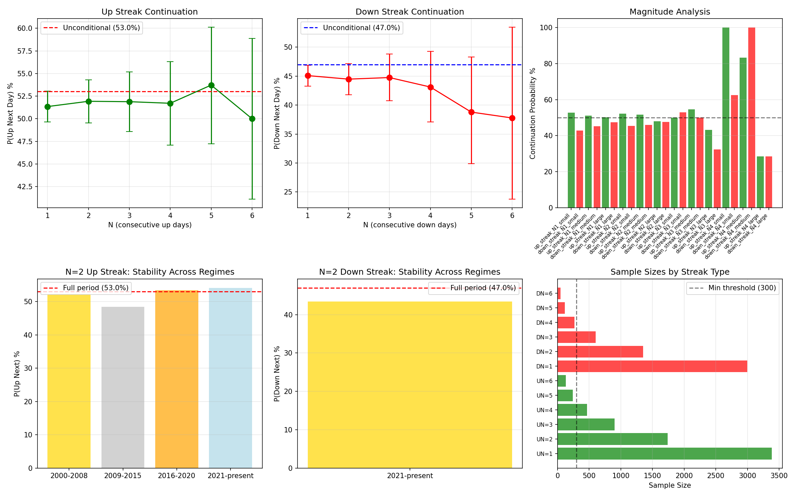

# RESEARCH-004: Trend Persistence Analysis

**Date:** 2026-06-08 17:14
**Dataset:** XAU/USD Cleaned (GC=F)
**Period:** 2000-08-30 to 2026-06-08
**Observations:** 6,464
**Unconditional P(Up):** 53.03%
**Unconditional P(Down):** 46.97%

## 1. Consecutive Up Days — Full Period

| N | Events | P(Up Next) | P(Down Next) | Uncond P(Up) | Deviation | Binom P | CI (95%) | Significant? |
|---|--------|------------|--------------|--------------|-----------|---------|----------|-------------|
| 1 | 3,383 | 51.34% | 48.66% | 53.03% | -1.68% | 0.0516 | [49.6%, 53.0%] | NO |
| 2 | 1,737 | 51.93% | 48.07% | 53.03% | -1.10% | 0.3611 | [49.5%, 54.3%] | NO |
| 3 | 902 | 51.88% | 48.12% | 53.03% | -1.14% | 0.5047 | [48.6%, 55.2%] | NO |
| 4 | 468 | 51.71% | 48.29% | 53.03% | -1.32% | 0.5786 | [47.1%, 56.3%] | NO |
| 5 | 242 | 53.72% | 46.28% | 53.03% | +0.69% | 0.8470 | [47.2%, 60.1%] | NO |
| 6 | 130 | 50.00% | 50.00% | 53.03% | -3.03% | 0.5387 | [41.1%, 58.9%] | NO |

## 2. Consecutive Down Days — Full Period

| N | Events | P(Down Next) | P(Up Next) | Uncond P(Down) | Deviation | Binom P | CI (95%) | Significant? |
|---|--------|--------------|------------|----------------|-----------|---------|----------|-------------|
| 1 | 2,996 | 45.09% | 54.91% | 46.97% | -1.88% | 0.0404 | [43.3%, 46.9%] | YES |
| 2 | 1,351 | 44.49% | 55.51% | 46.97% | -2.49% | 0.0678 | [41.8%, 47.2%] | NO |
| 3 | 601 | 44.76% | 55.24% | 46.97% | -2.22% | 0.2881 | [40.7%, 48.8%] | NO |
| 4 | 269 | 43.12% | 56.88% | 46.97% | -3.85% | 0.2218 | [37.1%, 49.3%] | NO |
| 5 | 116 | 38.79% | 61.21% | 46.97% | -8.18% | 0.0936 | [29.9%, 48.3%] | NO |
| 6 | 45 | 37.78% | 62.22% | 46.97% | -9.20% | 0.2348 | [23.8%, 53.5%] | NO |

## 3. Magnitude Analysis

Magnitude thresholds: Small (< 0.347%), Medium (0.347%-0.882%), Large (>0.882%)

| N | Magnitude | Streak Type | Events | P(Continue) | Binom P | Significant? |
|---|-----------|-------------|--------|-------------|---------|-------------|
| 1 | large | up_streak | 1140 | 50.26% | 0.8823 | NO |
| 1 | large | down_streak | 965 | 47.36% | 0.1074 | NO |
| 1 | medium | up_streak | 1148 | 51.13% | 0.4606 | NO |
| 1 | medium | down_streak | 1019 | 45.24% | 0.0026 | YES |
| 1 | small | up_streak | 1094 | 52.74% | 0.0744 | NO |
| 1 | small | down_streak | 1012 | 42.79% | 0.0000 | YES |
| 2 | large | up_streak | 206 | 48.06% | 0.6259 | NO |
| 2 | large | down_streak | 168 | 47.62% | 0.5893 | NO |
| 2 | medium | up_streak | 186 | 51.61% | 0.7140 | NO |
| 2 | medium | down_streak | 137 | 45.99% | 0.3930 | NO |
| 2 | small | up_streak | 186 | 52.15% | 0.6079 | NO |
| 2 | small | down_streak | 165 | 45.45% | 0.2757 | NO |
| 3 | large | up_streak | 37 | 43.24% | 0.5114 | NO |
| 3 | large | down_streak | 37 | 32.43% | 0.0470 | YES |
| 3 | medium | up_streak | 33 | 54.55% | 0.7283 | NO |
| 3 | medium | down_streak | 12 | 50.00% | 1.0000 | NO |
| 3 | small | up_streak | 26 | 50.00% | 1.0000 | NO |
| 3 | small | down_streak | 34 | 52.94% | 0.8642 | NO |
| 4 | large | up_streak | 7 | 28.57% | 0.4531 | NO |
| 4 | large | down_streak | 7 | 28.57% | 0.4531 | NO |
| 4 | medium | up_streak | 6 | 83.33% | 0.2188 | NO |
| 4 | medium | down_streak | 1 | 100.00% | 1.0000 | NO |
| 4 | small | up_streak | 2 | 100.00% | 0.5000 | NO |
| 4 | small | down_streak | 8 | 62.50% | 0.7266 | NO |

## 4. Regime Stability Analysis

### 4a. Up Streaks by Regime

| Regime | N | Events | P(Up Next) | Deviation | Binom P | Significant? |
|--------|---|--------|------------|-----------|---------|-------------|
| 2000-2008 | 1 | 1062 | 50.85% | -1.86% | 0.1574 | NO |
| 2000-2008 | 2 | 540 | 52.22% | -0.48% | 0.7302 | NO |
| 2000-2008 | 3 | 282 | 52.48% | -0.22% | 0.8582 | NO |
| 2000-2008 | 4 | 148 | 50.00% | -2.70% | 0.4602 | NO |
| 2000-2008 | 5 | 74 | 54.05% | +1.35% | 0.9076 | NO |
| 2000-2008 | 6 | 40 | 47.50% | -5.20% | 0.5283 | NO |
| 2009-2015 | 1 | 919 | 49.84% | -2.59% | 0.0552 | NO |
| 2009-2015 | 2 | 458 | 48.47% | -3.95% | 0.0548 | NO |
| 2009-2015 | 3 | 222 | 47.30% | -5.13% | 0.0928 | NO |
| 2009-2015 | 4 | 105 | 53.33% | +0.91% | 1.0000 | NO |
| 2009-2015 | 5 | 56 | 51.79% | -0.64% | 0.8939 | NO |
| 2009-2015 | 6 | 29 | 58.62% | +6.20% | 0.5818 | NO |
| 2016-2020 | 1 | 661 | 51.29% | -1.67% | 0.3705 | NO |
| 2016-2020 | 2 | 339 | 53.39% | +0.43% | 0.9134 | NO |
| 2016-2020 | 3 | 181 | 51.93% | -1.03% | 0.7665 | NO |
| 2016-2020 | 4 | 94 | 51.06% | -1.90% | 0.7568 | NO |
| 2016-2020 | 5 | 48 | 54.17% | +1.21% | 0.8863 | NO |
| 2016-2020 | 6 | 26 | 42.31% | -10.65% | 0.3274 | NO |
| 2021-present | 1 | 740 | 53.92% | -0.41% | 0.6323 | NO |
| 2021-present | 2 | 399 | 54.14% | -0.20% | 0.6883 | NO |
| 2021-present | 3 | 216 | 55.56% | +1.22% | 0.4956 | NO |
| 2021-present | 4 | 120 | 53.33% | -1.00% | 1.0000 | NO |
| 2021-present | 5 | 64 | 54.69% | +0.36% | 0.8038 | NO |
| 2021-present | 6 | 35 | 51.43% | -2.90% | 0.8671 | NO |

### 4b. Down Streaks by Regime

| Regime | N | Events | P(Down Next) | Deviation | Binom P | Significant? |
|--------|---|--------|--------------|-----------|---------|-------------|
| 2000-2008 | 1 | 952 | 45.27% | -2.02% | 0.2989 | NO |
| 2000-2008 | 2 | 430 | 46.05% | -1.25% | 0.7353 | NO |
| 2000-2008 | 3 | 198 | 42.93% | -4.37% | 0.2855 | NO |
| 2000-2008 | 4 | 85 | 42.35% | -4.94% | 0.4472 | NO |
| 2000-2008 | 5 | 36 | 38.89% | -8.41% | 0.4045 | NO |
| 2000-2008 | 6 | 14 | 50.00% | +2.70% | 1.0000 | NO |
| 2009-2015 | 1 | 833 | 44.78% | -2.80% | 0.2115 | NO |
| 2009-2015 | 2 | 372 | 43.82% | -3.76% | 0.2323 | NO |
| 2009-2015 | 3 | 163 | 46.63% | -0.95% | 0.9376 | NO |
| 2009-2015 | 4 | 76 | 47.37% | -0.21% | 1.0000 | NO |
| 2009-2015 | 5 | 36 | 38.89% | -8.69% | 0.4045 | NO |
| 2009-2015 | 6 | 14 | 42.86% | -4.72% | 0.7958 | NO |
| 2016-2020 | 1 | 588 | 45.24% | -1.80% | 0.4088 | NO |
| 2016-2020 | 2 | 266 | 44.36% | -2.68% | 0.4246 | NO |
| 2016-2020 | 3 | 118 | 45.76% | -1.28% | 0.8538 | NO |
| 2016-2020 | 4 | 54 | 40.74% | -6.30% | 0.4140 | NO |
| 2016-2020 | 5 | 22 | 31.82% | -15.22% | 0.2003 | NO |
| 2016-2020 | 6 | 7 | 14.29% | -32.75% | 0.1298 | NO |
| 2021-present | 1 | 621 | 45.25% | -0.42% | 0.3987 | NO |
| 2021-present | 2 | 281 | 43.42% | -2.25% | 0.2561 | NO |
| 2021-present | 3 | 122 | 44.26% | -1.41% | 0.5868 | NO |
| 2021-present | 4 | 54 | 40.74% | -4.93% | 0.4140 | NO |
| 2021-present | 5 | 22 | 45.45% | -0.21% | 1.0000 | NO |
| 2021-present | 6 | 10 | 30.00% | -15.67% | 0.3527 | NO |

## 5. Edge Candidate Evaluation

### Success Criteria:
- Sample Size > 300
- P-value < 0.05
- Probability deviation > 5% (absolute)
- Stable across regimes

| Edge Type | Sample | P(Continue) | Deviation | Binom P | N>300 | P<0.05 | |Dev|>5% | Stable | PASS ALL? |
|-----------|--------|-------------|-----------|---------|-------|--------|---------|--------|-----------|
| Up Streak N=1 | 3,383 | 51.34% | -1.68% | 0.0516 | YES | no | no | no | NO |
| Up Streak N=2 | 1,737 | 51.93% | -1.10% | 0.3611 | YES | no | no | no | NO |
| Up Streak N=3 | 902 | 51.88% | -1.14% | 0.5047 | YES | no | no | no | NO |
| Up Streak N=4 | 468 | 51.71% | -1.32% | 0.5786 | YES | no | no | no | NO |
| Up Streak N=5 | 242 | 53.72% | +0.69% | 0.8470 | no | no | no | no | NO |
| Up Streak N=6 | 130 | 50.00% | -3.03% | 0.5387 | no | no | no | no | NO |
| Down Streak N=1 | 2,996 | 45.09% | -1.88% | 0.0404 | YES | YES | no | no | NO |
| Down Streak N=2 | 1,351 | 44.49% | -2.49% | 0.0678 | YES | no | no | no | NO |
| Down Streak N=3 | 601 | 44.76% | -2.22% | 0.2881 | YES | no | no | no | NO |
| Down Streak N=4 | 269 | 43.12% | -3.85% | 0.2218 | no | no | no | no | NO |
| Down Streak N=5 | 116 | 38.79% | -8.18% | 0.0936 | no | no | YES | no | NO |
| Down Streak N=6 | 45 | 37.78% | -9.20% | 0.2348 | no | no | YES | no | NO |

### No Edge Candidates Meet All Criteria

Closest candidates:

- Down Streak N=1: 2/4 criteria met
- Up Streak N=1: 1/4 criteria met
- Up Streak N=2: 1/4 criteria met

## 6. Charts

---
*Generated automatically by XAU/USD Edge Discovery Framework*