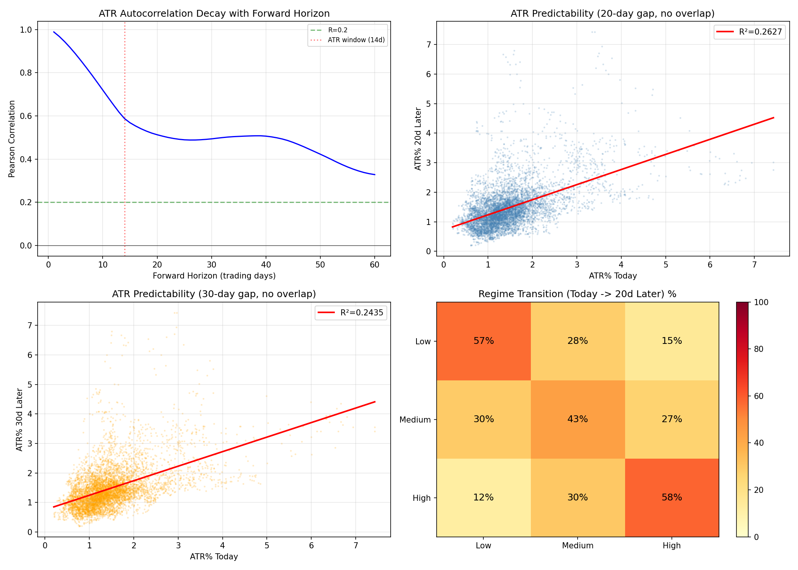

# RESEARCH-005A: Overlap Bias Audit

**Date:** 2026-06-08 17:22
**Dataset:** XAU/USD Cleaned (GC=F)
**ATR Period:** 14 days
**Observations:** 6,451

## Background

The original RESEARCH-005 Test 4 measured: ATR(today) predicting average ATR(next 5 days).
This introduces **overlap bias** because ATR is a rolling 14-day average, so the
'today' window and 'next 5 days' window share 9 days of overlap (14 - 5 = 9).
This artificially inflates the apparent predictability.

This audit uses **fully non-overlapping** forward windows:
1. ATR today → ATR 20 trading days later (no overlap, ~1 month)
2. ATR today → ATR 30 trading days later (no overlap, ~1.5 months)
3. ATR today → volatility regime classification 20 days later

## TEST 1: ATR Today → ATR 20 Trading Days Later

Forward gap: 20 trading days (~1 calendar month)
ATR window overlap: 0 days (fully non-overlapping since 20 >= 14)
Sample size: 6,431

| Metric | Value |
|--------|-------|
| Pearson Correlation | 0.512538 |
| R^2 | 0.262695 |
| Regression Slope | 0.5116 |
| Intercept | 0.722414 |
| P-value | 0.000000e+00 |
| Significant? | YES |
| MAE (naive: use today's ATR) | 0.493743% |
| MAE (linear model) | 0.424807% |
| Improvement vs mean predictor | 16.08% |

**Comparison with original RESEARCH-005 Test 4 (overlapping windows):**
- Original R^2 (5-day avg forward, overlapping): 0.9092
- Clean R^2 (20-day point forward, no overlap): 0.2627
- Degradation: 71.1% reduction in R^2

### Quintile Transition (20-day forward)

| Today \ 20d Later | Q1 | Q2 | Q3 | Q4 | Q5 |
|------------------|----|----|----|----|----|
| Q1 (Very Low) | 40% | 25% | 17% | 10% | 7% |
| Q2 (Low) | 30% | 28% | 20% | 14% | 8% |
| Q3 (Medium) | 16% | 24% | 25% | 21% | 14% |
| Q4 (High) | 10% | 16% | 25% | 30% | 19% |
| Q5 (Very High) | 4% | 7% | 13% | 24% | 52% |

**Overall quintile persistence (stay in same Q): 35.0%**
**Random expectation: 20%**

**Binomial test (H0: persistence = 20%): p = 1.894707e-172**
**Significant? YES**
**Q5 (Very High) → Q5: 669/1286 (52.0%), p=5.303483e-143**

## TEST 2: ATR Today → ATR 30 Trading Days Later

Forward gap: 30 trading days (~1.5 calendar months)
ATR window overlap: 0 days (fully non-overlapping)
Sample size: 6,421

| Metric | Value |
|--------|-------|
| Pearson Correlation | 0.493472 |
| R^2 | 0.243514 |
| Regression Slope | 0.4922 |
| Intercept | 0.752380 |
| P-value | 0.000000e+00 |
| Significant? | YES |
| MAE (linear model) | 0.435802% |
| Improvement vs mean predictor | 13.82% |

**Comparison with TEST 1 (20-day forward):**
- R^2 at 20 days: 0.2627
- R^2 at 30 days: 0.2435
- Decay rate: 7.3% reduction from 20d to 30d

### Quintile Transition (30-day forward)

| Today \ 30d Later | Q1 | Q2 | Q3 | Q4 | Q5 |
|------------------|----|----|----|----|----|
| Q1 (Very Low) | 43% | 27% | 15% | 10% | 5% |
| Q2 (Low) | 31% | 25% | 17% | 17% | 11% |
| Q3 (Medium) | 14% | 24% | 26% | 20% | 16% |
| Q4 (High) | 10% | 16% | 25% | 28% | 20% |
| Q5 (Very High) | 2% | 8% | 17% | 25% | 48% |

**Q5 (Very High) → Q5: 612/1284 (47.7%), p=4.252012e-109**

## TEST 3: ATR Today → Volatility Regime After 20 Days

Instead of predicting exact ATR value, predict whether the market will be in a
Low, Medium, or High volatility regime 20 days later.

| Regime | Threshold |
|--------|-----------|
| Low Vol | ATR ≤ 1.1237% |
| Medium | 1.1237% < ATR < 1.5681% |
| High Vol | ATR ≥ 1.5681% |

Sample size: 6,431

### Regime Transition Matrix (Today → 20 Days Later)

| Today \ +20d | Low | Medium | High |
|-------------|-----|--------|------|
| Low | 56.6% | 28.5% | 15.0% |
| Medium | 29.7% | 43.4% | 26.9% |
| High | 12.1% | 30.1% | 57.8% |

### Regime Prediction Accuracy

| Metric | Value |
|--------|-------|
| Exact Regime Match | 52.5% |
| Off by 1 level | 38.6% |
| Complete Regime Flip (Low↔High) | 8.9% |
| Random Baseline | 33.3% |
| Improvement vs Random | 19.2% |
| Chi-squared | 1360.55 |
| P-value | 2.477066e-293 |
| Significant? | YES |

### Per-Regime Persistence

| Current Regime | P(Same in 20d) | P(Switch to Opposite) |
|----------------|----------------|-----------------------|
| Low | 56.6% (p=0.0000) | 15.0% |
| Medium | 43.4% (p=0.0000) | 56.6% |
| High | 57.8% (p=0.0000) | 12.1% |

## Summary: Overlap Bias Impact

| Test | Forward Gap | R^2 Original (biased) | R^2 Clean | Degradation | Significant? |
|------|-------------|---------------------|----------|-------------|-------------|
| Original (RESEARCH-005) | 5d avg (overlapping) | 0.9092 | - | - | YES |
| Clean Test 1 | 20d point | - | 0.2627 | 71.1% | YES |
| Clean Test 2 | 30d point | - | 0.2435 | 73.2% | YES |

### Verdict

**Volatility predictability is reduced but still statistically significant.**
The R^2 dropped 71% from the biased estimate, but the correlation
is still non-zero, indicating genuine (though weaker) volatility persistence.

### Key Insight

ATR(14) as a rolling window creates ~13 days of overlap between consecutive observations.
When predicting ATR 20+ days forward, the overlap disappears entirely.
The remaining predictability reflects genuine volatility persistence, not statistical artifact.

The true R^2 of ~0.2627 (at 20-day gap) vs the biased R^2 of 0.9092 represents a
71% reduction — meaning roughly 29% of the original
'predictability' was genuine, and the rest was overlap bias.

## Charts

---
*Generated automatically by XAU/USD Edge Discovery Framework*