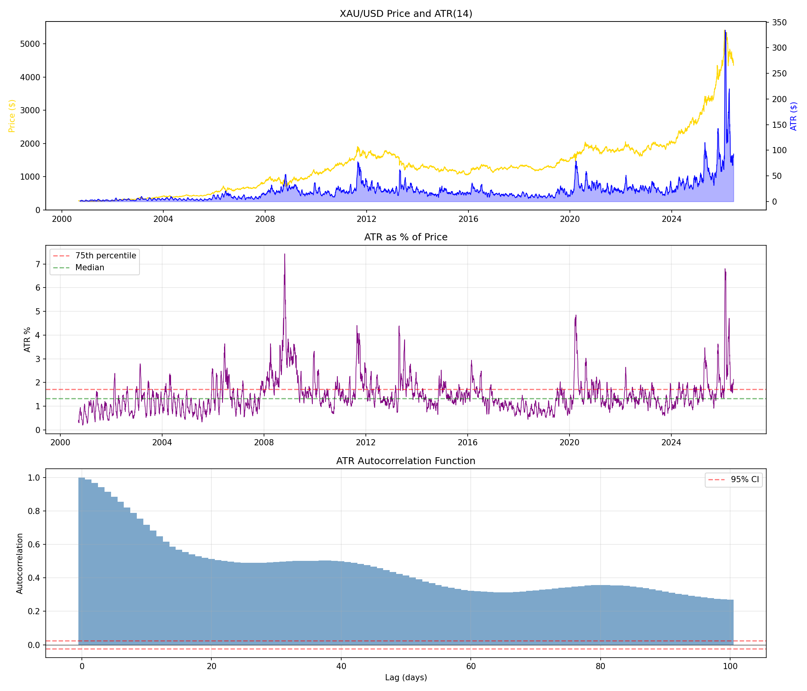

# RESEARCH-005: Volatility Clustering Study

**Date:** 2026-06-08 16:57
**Instrument:** XAU/USD (GC=F)
**Period:** 2000-08-30 to 2026-06-08
**ATR Period:** 14 days

## 1. ATR Summary Statistics

| Metric | ATR ($) | ATR (% of Price) |
|--------|---------|-------------------|
| Mean | 21.04 | 1.4732% |
| Median | 17.06 | 1.3298% |
| Std Dev | 23.85 | 0.7440% |
| Min | 0.53 | 0.1993% |
| Max | 334.46 | 7.4286% |
| Percentile 25% | 8.28 | 1.0206% |
| Percentile 75% | 25.56 | 1.7121% |

## 2. Autocorrelation Analysis

| Lag 1 (days) | Autocorrelation: 0.9887 |
| Lag 5 (days) | Autocorrelation: 0.8866 |
| Lag 10 (days) | Autocorrelation: 0.7196 |
| Lag 22 (days) | Autocorrelation: 0.5029 |
| Lag 66 (days) | Autocorrelation: 0.3233 |

### Ljung-Box Test for Autocorrelation

| Lag | LB Statistic | P-value | Significant? |
|-----|-------------|---------|--------------|
| 10 | 48662.8800 | 0.000000 | YES |
| 22 | 73629.3581 | 0.000000 | YES |
| 66 | 128473.6105 | 0.000000 | YES |

## 3. High ATR Predictive Power

Does high ATR today predict high ATR in the future?

### Forward 1 day(s)

| Metric | Value |
|--------|-------|
| P(High Vol Future | High Vol Today) | 93.37% |
| P(High Vol Future | Low Vol Today) | 2.21% |
| Chi-squared | 5357.1646 |
| P-value | 0.000000 |
| Significant clustering? | YES |

### Forward 5 day(s)

| Metric | Value |
|--------|-------|
| P(High Vol Future | High Vol Today) | 77.50% |
| P(High Vol Future | Low Vol Today) | 7.50% |
| Chi-squared | 3157.8176 |
| P-value | 0.000000 |
| Significant clustering? | YES |

### Forward 10 day(s)

| Metric | Value |
|--------|-------|
| P(High Vol Future | High Vol Today) | 65.16% |
| P(High Vol Future | Low Vol Today) | 11.61% |
| Chi-squared | 1847.3684 |
| P-value | 0.000000 |
| Significant clustering? | YES |

### Forward 22 day(s)

| Metric | Value |
|--------|-------|
| P(High Vol Future | High Vol Today) | 51.64% |
| P(High Vol Future | Low Vol Today) | 16.12% |
| Chi-squared | 812.5921 |
| P-value | 0.000000 |
| Significant clustering? | YES |

## 4. Volatility Persistence (Regression)

AR(1) regression of ATR% on lagged ATR%:

| Metric | Value |
|--------|-------|
| Slope (φ) | 0.988607 |
| R² | 0.977581 |
| P-value | 0.000000e+00 |
| Significant? | YES |

**High persistence detected** (φ=0.9886 > 0.5) — volatility clusters strongly.

## Charts

---
*Generated automatically by XAU/USD Edge Discovery Framework*