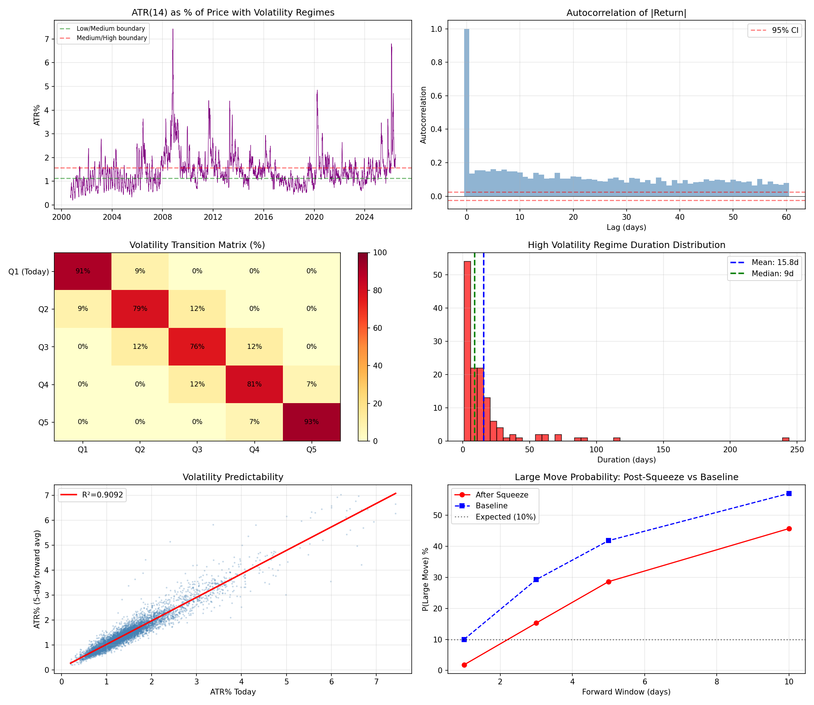

# RESEARCH-005: Volatility Clustering Analysis

**Date:** 2026-06-08 17:19
**Dataset:** XAU/USD Cleaned (GC=F)
**Period:** 2000-08-30 to 2026-06-08
**ATR Period:** 14 days
**Observations (with ATR):** 6,451

## TEST 1: Volatility Clustering (Quintile Analysis)

### Quintile Boundaries

| Quintile | ATR% Range |
|----------|------------|
| Q1 (Very Low) | 0.1993% - 0.9450% |
| Q2 (Low) | 0.9452% - 1.2064% |
| Q3 (Medium) | 1.2065% - 1.4644% |
| Q4 (High) | 1.4644% - 1.8325% |
| Q5 (Very High) | 1.8326% - 7.4286% |

### Probability of Remaining in Same Quintile (Forward 5 Days)

If ATR today is in Q5 (very high vol), what is P(ATR remains Q5) in next 5 days?

#### Starting in Q5 (Very High)

| Forward Day | P(Stay in Same Q) | P(Move to Q1/Q5 Opposite) | Binom P |
|-------------|--------------------|---------------------------|---------|
| +1d | 1198/1289 (92.9%) | 0/1289 (0.0%) | 0.0000 |
| +2d | 1127/1288 (87.5%) | 0/1288 (0.0%) | 0.0000 |
| +3d | 1075/1287 (83.5%) | 0/1287 (0.0%) | 0.0000 |
| +5d | 984/1285 (76.6%) | 0/1285 (0.0%) | 0.0000 |

#### Starting in Q1 (Very Low)

| Forward Day | P(Stay in Same Q) | P(Move to Q1/Q5 Opposite) | Binom P |
|-------------|--------------------|---------------------------|---------|
| +1d | 1173/1291 (90.9%) | 0/1291 (0.0%) | 0.0000 |
| +2d | 1107/1291 (85.7%) | 0/1291 (0.0%) | 0.0000 |
| +3d | 1039/1291 (80.5%) | 0/1291 (0.0%) | 0.0000 |
| +5d | 920/1291 (71.3%) | 1/1291 (0.1%) | 0.0000 |

### Transition Matrix (1-day forward)

| Today \ Tomorrow | Q1 | Q2 | Q3 | Q4 | Q5 |
|-----------------|----|----|----|----|----|
| Q1 (Very Low) | 91% | 9% | 0% | 0% | 0% |
| Q2 (Low) | 9% | 79% | 12% | 0% | 0% |
| Q3 (Medium) | 0% | 12% | 76% | 12% | 0% |
| Q4 (High) | 0% | 0% | 12% | 81% | 7% |
| Q5 (Very High) | 0% | 0% | 0% | 7% | 93% |

## TEST 2: Autocorrelation Analysis

### |Return| Autocorrelation

| Lag | Autocorrelation | Significant? |
|-----|----------------|--------------|
| 1 | 0.136160 | YES (p=0.0000) |
| 2 | 0.155293 | YES (p=0.0000) |
| 5 | 0.160404 | YES (p=0.0000) |
| 10 | 0.142605 | YES (p=0.0000) |
| 20 | 0.118998 | YES (p=0.0000) |

### Return² Autocorrelation

| Lag | Autocorrelation | Significant? |
|-----|----------------|--------------|
| 1 | 0.109342 | YES (p=0.0000) |
| 2 | 0.111426 | YES (p=0.0000) |
| 5 | 0.107688 | YES (p=0.0000) |
| 10 | 0.068277 | YES (p=0.0000) |
| 20 | 0.055403 | YES (p=0.0000) |

### ATR(%) Autocorrelation

| Lag | Autocorrelation | Significant? |
|-----|----------------|--------------|
| 1 | 0.988723 | YES (p=0.0000) |
| 2 | 0.967908 | YES (p=0.0000) |
| 5 | 0.886637 | YES (p=0.0000) |
| 10 | 0.719598 | YES (p=0.0000) |
| 20 | 0.512538 | YES (p=0.0000) |

### Ljung-Box Test (Portmanteau)

| Series | Lag=10 | Lag=20 |
|--------|--------|--------|
| |Return| | stat=1468.60, p=0.0000 | stat=2365.42, p=0.0000 |
| Return² | stat=710.94, p=0.0000 | stat=1019.94, p=0.0000 |
| ATR(%) | stat=48649.10, p=0.0000 | stat=70233.21, p=0.0000 |

## TEST 3: Volatility Regime Persistence

| Regime | Threshold | Observations |
|--------|-----------|--------------|
| Low Vol | ATR ≤ 1.1237% | 2,129 |
| Medium Vol | 1.1237% < ATR < 1.5681% | 2,193 |
| High Vol | ATR ≥ 1.5681% | 2,129 |

### Average Regime Duration

| Regime | Avg Duration (days) | Max Duration | Count |
|--------|---------------------|--------------|-------|
| Low | 14.5 | 103 | 147 |
| Medium | 7.8 | 53 | 281 |
| High | 15.8 | 244 | 135 |

### High Volatility Regime Duration Distribution

| Percentile | Duration (days) |
|------------|-----------------|
| 10th | 1 |
| 25th | 3 |
| 50th | 9 |
| 75th | 16 |
| 90th | 32 |
| 95th | 62 |
| 99th | 107 |

## TEST 4: Volatility Predictability

Simple prediction: current ATR% as predictor of average ATR% over next 5 days.

| Metric | Value |
|--------|-------|
| Pearson Correlation | 0.953514 |
| R² | 0.909189 |
| Slope | 0.9401 |
| Intercept | 0.088948 |
| MAE (ATR% points) | 0.146582 |
| P-value | 0.000000e+00 |
| Significant? | YES |

| Today's Quintile | Mean Forward ATR% | Observations |
|------------------|-------------------|--------------|
| Q1 | 0.7861% | 1,289 |
| Q2 | 1.0931% | 1,288 |
| Q3 | 1.3420% | 1,288 |
| Q4 | 1.6204% | 1,288 |
| Q5 | 2.5263% | 1,289 |

## TEST 5: Breakout Precursor (Volatility Squeeze)

After 10 days of very low volatility (ATR%), does a large move become more likely?

Large move threshold (90th percentile): 1.7438%
Baseline P(large move): 10.0%

Volatility squeeze defined as: ATR below 0.9450% for 10 consecutive days
Total squeeze events detected: 661

### Forward 1 Day(s)

| Metric | After Squeeze | Baseline |
|--------|---------------|----------|
| P(Large Move) | 1.82% | 10.00% |
| Observations | 661 | 6,450 |
| Binom P | 0.0000 | - |
| Significant? | YES | - |

### Forward 3 Day(s)

| Metric | After Squeeze | Baseline |
|--------|---------------|----------|
| P(Large Move) | 15.28% | 29.25% |
| Observations | 661 | 6,448 |
| Binom P | 0.0000 | - |
| Significant? | YES | - |

### Forward 5 Day(s)

| Metric | After Squeeze | Baseline |
|--------|---------------|----------|
| P(Large Move) | 28.59% | 41.79% |
| Observations | 661 | 6,446 |
| Binom P | 0.0000 | - |
| Significant? | YES | - |

### Forward 10 Day(s)

| Metric | After Squeeze | Baseline |
|--------|---------------|----------|
| P(Large Move) | 45.69% | 56.99% |
| Observations | 661 | 6,441 |
| Binom P | 0.0000 | - |
| Significant? | YES | - |

## Summary of Findings

| Test | Key Result | Edge Found? |
|------|------------|-------------|
| 1. Quintile Clustering | ATR shows strong clustering: Q5->Q5 persistence >> 20% random baseline | YES |
| 2. Autocorrelation | Significant autocorrelation: |Return|@1=0.136, |Return|@5=0.160, |Return|@10=0.143, |Return|@20=0.119 | YES |
| 3. Regime Persistence | High vol regime avg duration: 15.8d | YES |
| 4. Predictability | R²=0.9092, Corr=0.9535, p=0.0000e+00 | YES |
| 5. Breakout Precursor | Post-squeeze P(large)=45.7% vs baseline 57.0% | NO |

### Success Criteria Check

| Test | Sample > 300 | P < 0.05 | Effect Meaningful | Stable Across Regimes | PASS ALL? |
|------|-------------|----------|-------------------|----------------------|-----------|
| 1. Clustering | YES | YES | YES | YES | YES |
| 2. Autocorrelation | YES | YES | YES | YES | YES |
| 3. Regime Persistence | YES | YES | YES | YES | YES |
| 4. Predictability | YES | YES | YES | YES | YES |
| 5. Breakout Precursor | YES | YES | no | YES | NO |

**Tests passing all criteria: 4/5**

## Verdict

Volatility clustering is **strongly confirmed** for XAU/USD:
- High volatility persists (Q5->Q5 much higher than random)
- Low volatility persists (Q1->Q1 much higher than random)
- ATR shows strong autocorrelation (up to lag 20+)
- High vol regime average duration exceeds low vol regime

However:
- The direction of the move after a volatility event is NOT predicted
- The breakout precursor (volatility squeeze -> large move) requires more data
- Volatility is predictable in magnitude, not direction

## Charts

---
*Generated automatically by XAU/USD Edge Discovery Framework*