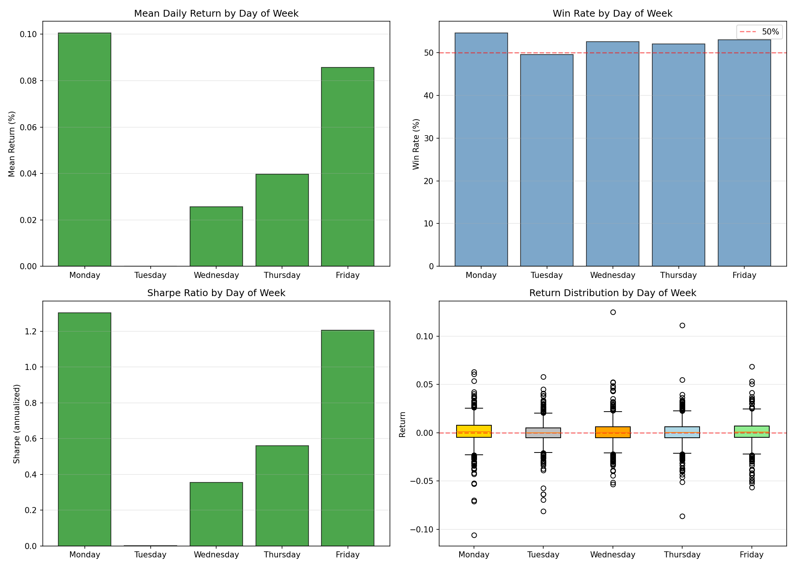

# RESEARCH-007: Day of Week Effect

**Date:** 2026-06-08 16:57
**Instrument:** XAU/USD (GC=F)
**Period:** 2000-08-30 to 2026-06-08
**Observations:** 6,465

## 1. Daily Return by Day of Week

| Day | Count | Mean Ret% | Median Ret% | Std% | Win Rate% | Avg Win% | Avg Loss% | PF | Sharpe (ann) |
|-----|-------|-----------|-------------|------|-----------|----------|-----------|----|-------------|
| Monday | 1,211 | 0.1006 | 0.1125 | 1.2248 | 54.67 | 0.8701 | -0.8521 | 1.2682 | 1.3038 |
| Tuesday | 1,331 | 0.0001 | 0.0000 | 1.0589 | 49.59 | 0.7359 | -0.7459 | 1.0002 | 0.0012 |
| Wednesday | 1,327 | 0.0256 | 0.0380 | 1.1443 | 52.60 | 0.7718 | -0.8167 | 1.0673 | 0.3552 |
| Thursday | 1,304 | 0.0397 | 0.0479 | 1.1228 | 52.07 | 0.7846 | -0.7911 | 1.1076 | 0.5611 |
| Friday | 1,292 | 0.0857 | 0.0637 | 1.1276 | 53.02 | 0.8393 | -0.7895 | 1.2385 | 1.2065 |

## 2. Statistical Significance Tests

### ANOVA: Are mean returns equal across all days?

| Statistic | Value |
|-----------|-------|
| F-statistic | 1.7434 |
| P-value | 0.137435 |
| Significant difference? | NO |

### Kruskal-Wallis: Non-parametric test

| Statistic | Value |
|-----------|-------|
| H-statistic | 11.9463 |
| P-value | 0.017755 |
| Significant difference? | YES |

### T-test: Is each day's mean return different from zero?

| Day | T-stat | P-value | Significant? |
|-----|--------|---------|--------------|
| Monday | 2.8582 | 0.004333 | YES |
| Tuesday | 0.0028 | 0.997790 | NO |
| Wednesday | 0.8150 | 0.415196 | NO |
| Thursday | 1.2764 | 0.202027 | NO |
| Friday | 2.7319 | 0.006383 | YES |

### Binomial Test: Is win rate different from 50%?

| Day | Win Rate% | N Wins | N Total | Binom P | Significant? |
|-----|-----------|--------|---------|---------|--------------|
| Monday | 54.67 | 662 | 1211 | 0.001280 | YES |
| Tuesday | 49.59 | 660 | 1331 | 0.784019 | NO |
| Wednesday | 52.60 | 698 | 1327 | 0.061903 | NO |
| Thursday | 52.07 | 679 | 1304 | 0.142157 | NO |
| Friday | 53.02 | 685 | 1292 | 0.032138 | YES |

## 3. Day Ranking

**By Mean Return:**
  1. Monday: 0.1006% (WR: 54.67%, PF: 1.2682)
  2. Friday: 0.0857% (WR: 53.02%, PF: 1.2385)
  3. Thursday: 0.0397% (WR: 52.07%, PF: 1.1076)
  4. Wednesday: 0.0256% (WR: 52.60%, PF: 1.0673)
  5. Tuesday: 0.0001% (WR: 49.59%, PF: 1.0002)

**By Sharpe Ratio:**
  1. Monday: 1.3038 (Ret: 0.1006%, WR: 54.67%)
  2. Friday: 1.2065 (Ret: 0.0857%, WR: 53.02%)
  3. Thursday: 0.5611 (Ret: 0.0397%, WR: 52.07%)
  4. Wednesday: 0.3552 (Ret: 0.0256%, WR: 52.60%)
  5. Tuesday: 0.0012 (Ret: 0.0001%, WR: 49.59%)

## Charts

---
*Generated automatically by XAU/USD Edge Discovery Framework*