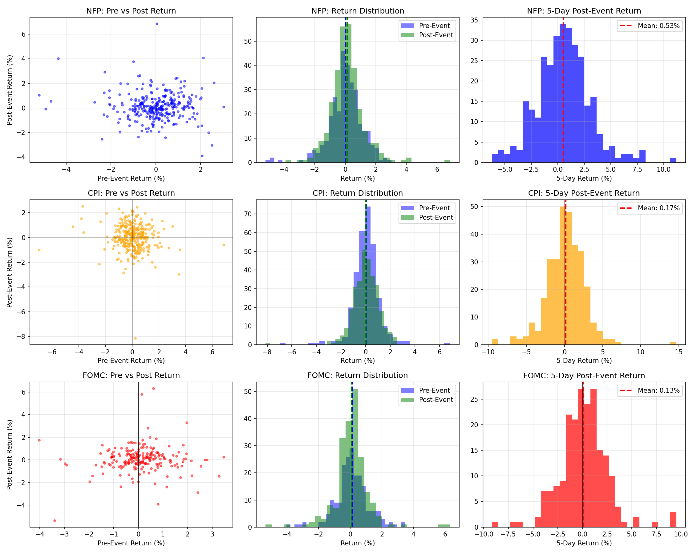

# RESEARCH-008: Macro Event Effect

**Date:** 2026-06-08 16:58
**Instrument:** XAU/USD (GC=F)
**Period:** 2000-08-30 to 2026-06-08

## Methodology

For each event type (CPI, NFP, FOMC):
- Find the nearest trading day to the event date
- Calculate return 1 day before, 1 day after, and 3 days after
- Calculate volatility around event vs normal periods
- Test if event returns differ significantly from non-event returns

## NFP Events

| Metric | Pre-Event (-1d) | Event Day | Post-Event (+1d) | Post-Event (+3d) | Non-Event |
|--------|----------------|-----------|------------------|--------------------|-----------|
| Avg Return % | 0.0447 | 0.0179 | 0.0903 | 0.2787 | 0.0508 |
| Std Dev % | 1.0163 | 1.1097 | 1.2399 | 1.9574 | 1.1368 |
| Win Rate % | 53.5484 | 52.5806 | 53.3762 | 53.5484 | 52.3314 |

### Significance Tests

- **Post-Event vs Non-Event**: t=0.5941, p=0.552479 (Not significant)
- **Post+3d vs Non-Event**: t=3.2909, p=0.001004 (SIGNIFICANT)
- **Pre-Event vs Post-Event**: t=-0.5004, p=0.616939 (Not significant)

---

## CPI Events

| Metric | Pre-Event (-1d) | Event Day | Post-Event (+1d) | Post-Event (+3d) | Non-Event |
|--------|----------------|-----------|------------------|--------------------|-----------|
| Avg Return % | 0.1583 | 0.0408 | -0.0744 | -0.0517 | 0.0497 |
| Std Dev % | 1.1018 | 1.1378 | 1.1138 | 2.0168 | 1.1354 |
| Win Rate % | 58.2524 | 53.3981 | 48.3871 | 50.6452 | 52.2904 |

### Significance Tests

- **Post-Event vs Non-Event**: t=-1.8788, p=0.060312 (Not significant)
- **Post+3d vs Non-Event**: t=-1.4601, p=0.144316 (Not significant)
- **Pre-Event vs Post-Event**: t=2.6092, p=0.009296 (SIGNIFICANT)

---

## FOMC Events

| Metric | Pre-Event (-1d) | Event Day | Post-Event (+1d) | Post-Event (+3d) | Non-Event |
|--------|----------------|-----------|------------------|--------------------|-----------|
| Avg Return % | 0.1596 | 0.1060 | 0.0052 | 0.1812 | 0.0474 |
| Std Dev % | 1.1946 | 1.0811 | 1.2480 | 2.1135 | 1.1372 |
| Win Rate % | 56.7961 | 52.4272 | 52.6570 | 55.0725 | 52.3406 |

### Significance Tests

- **Post-Event vs Non-Event**: t=-0.5238, p=0.600408 (Not significant)
- **Post+3d vs Non-Event**: t=1.6033, p=0.108911 (Not significant)
- **Pre-Event vs Post-Event**: t=1.2812, p=0.200842 (Not significant)

---

## Charts

## Summary

| Event Period | N Events | Avg Ret% | WR% | Binom P | Significant? |
|-------------|----------|----------|-----|---------|--------------|
| No significant macro event edges found | | | | | |

## Conclusion

Based on approximate event dates:
- No statistically significant macro event edges detected
- Note: CPI and FOMC dates are approximate; precise economic calendar data would improve accuracy
- NFP dates (first Friday of month) are more reliable

---
*Generated automatically by XAU/USD Edge Discovery Framework*